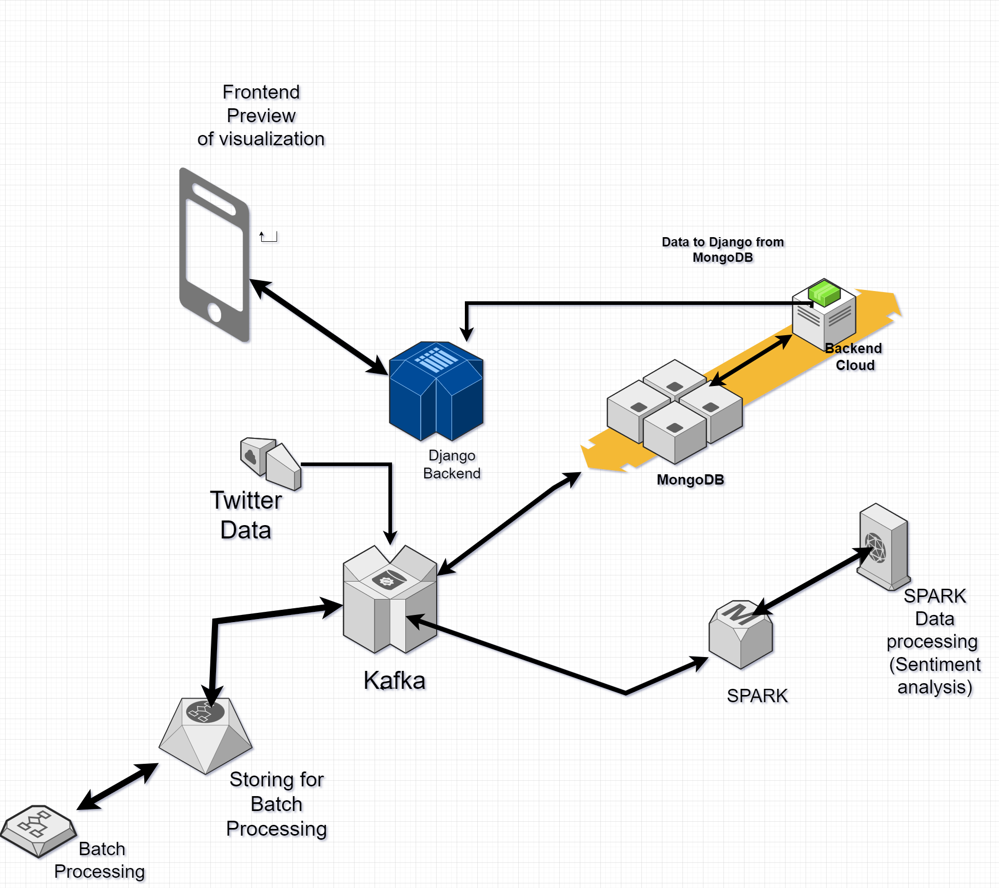
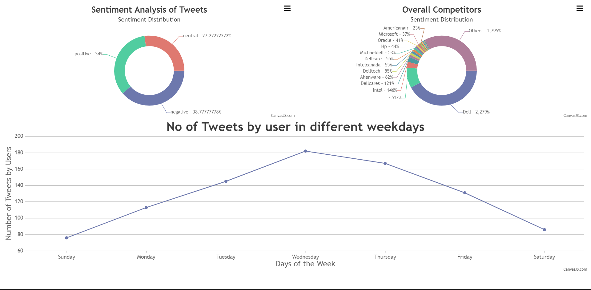

# Real-Time Sentiment Analysis Project Architecture

## Overview
This document presents the architecture and steps for setting up a real-time sentiment analysis project. The project aims to collect, process, and visualize sentiment data from social media platforms, with a focus on Twitter. It utilizes a combination of Docker, Kafka, Python, Spark, MongoDB, and Django to create a scalable and powerful system for monitoring customer sentiment trends in real-time.



## Components

### 1. Docker Containers
Docker containers provide isolation for various project components, allowing for easy deployment and scalability. They encapsulate Kafka, Spark, Python scripts, and MongoDB, ensuring efficient resource management.

### 2. Kafka
Kafka acts as a central message broker in the architecture, ingesting data from various sources and streaming it downstream. It provides reliable data transport and real-time processing capabilities.

### 3. Twitter Data Collector
A Python script serves as the Twitter data collector. It continuously gathers real-time Twitter data, including tweets, usernames, and metadata, and sends this data to Kafka for further processing.

### 4. Spark Processing
Apache Spark plays a crucial role in the architecture, consuming data from Kafka. It performs sentiment analysis using libraries like TextBlob, allowing for the classification of tweets into positive, negative, or neutral sentiments. Additionally, Spark extracts mentions of competitors from the tweets.

### 5. MongoDB
MongoDB serves as the database for storing processed sentiment data. Python scripts consume data from Kafka, process it further if needed, and store it in MongoDB for easy retrieval and analysis.

### 6. Django Web Application
A Django web application provides the user interface for real-time sentiment analysis insights. This component connects to MongoDB, retrieves sentiment data, and presents it through interactive visualizations, enabling users to monitor customer sentiment trends effectively.

## Data Flow

The architecture's data flow ensures the seamless processing of real-time sentiment data:

1. Twitter data is continuously collected and ingested into Kafka, where it is made available for processing.
2. Apache Spark processes the incoming data, performing sentiment analysis and competitor mention extraction.
3. Processed data is sent to another Kafka topic for further consumption and analysis.
4. Python scripts consume, process, and store data in MongoDB, making it accessible for query and analysis.
5. The Django web application connects to MongoDB and displays real-time sentiment insights, allowing users to interact with the data and gain valuable insights.

# Real-Time Sentiment Analysis Project Setup

Follow these steps to set up and run the real-time sentiment analysis project:

## Step 1: Initiate Docker Compose

Initiate Docker Compose and start the defined containers using the following command:
```shell
docker-compose up --build -d
```

## Step 2: Verify Container Status

Verify the status and information of the containers using the following command:
```shell
docker-compose ps
```

## Step 3: Update Ubuntu Packages

Update Ubuntu packages to ensure you have the latest information about available packages:
```shell
sudo apt update
```

## Step 4: Install Python and Pip

Install Python 3 and pip, which are essential for managing Python package dependencies:
```shell
sudo apt install python3-pip -y
```

## Step 5: Install Project Dependencies

Install project dependencies by running the following command:
```shell
pip install -r requirements.txt
```

## Step 6 (Parallel): Twitter Data Collection and Kafka Consumer/Producer

Execute the Twitter data collection script with the following command to collect real-time Twitter data and send it to Kafka:
```shell
python3 producer_TwitterData.py
```

At the same time, run the Kafka consumer/producer script with the following command to consume data from Kafka, perform additional processing, and send the results to another Kafka topic:
```shell
python3 kafka_consumer_producer.py
```

## Step 7 (Parallel): Kafka Data Processing and MongoDB

Consume Kafka data, process it, and store it in MongoDB by running the following command. This step may involve batch processing of data:
```shell
python3 kafka_consumer_MangoDB.py
```

## Step 8: Verify MongoDB Data

Verify that the data has been successfully appended to MongoDB by querying the database.

## Step 9: Django Web Application

Create a Django web application for front-end visualization by navigating to the Twitter_Django folder and running the application with the following command:
```shell
python3 manage.py runserver
```
Ensure that all components are running correctly, and access the Django web application to view and interact with real-time sentiment insights.

# Project Output
The output image or screenshots of the project's real-time sentiment analysis dashboard here:



In the image above, you can see the real-time sentiment analysis dashboard generated by the Django web application. It provides interactive visualizations and insights into customer sentiment trends on social media platforms, allowing businesses to make data-driven decisions and monitor their online reputation.

